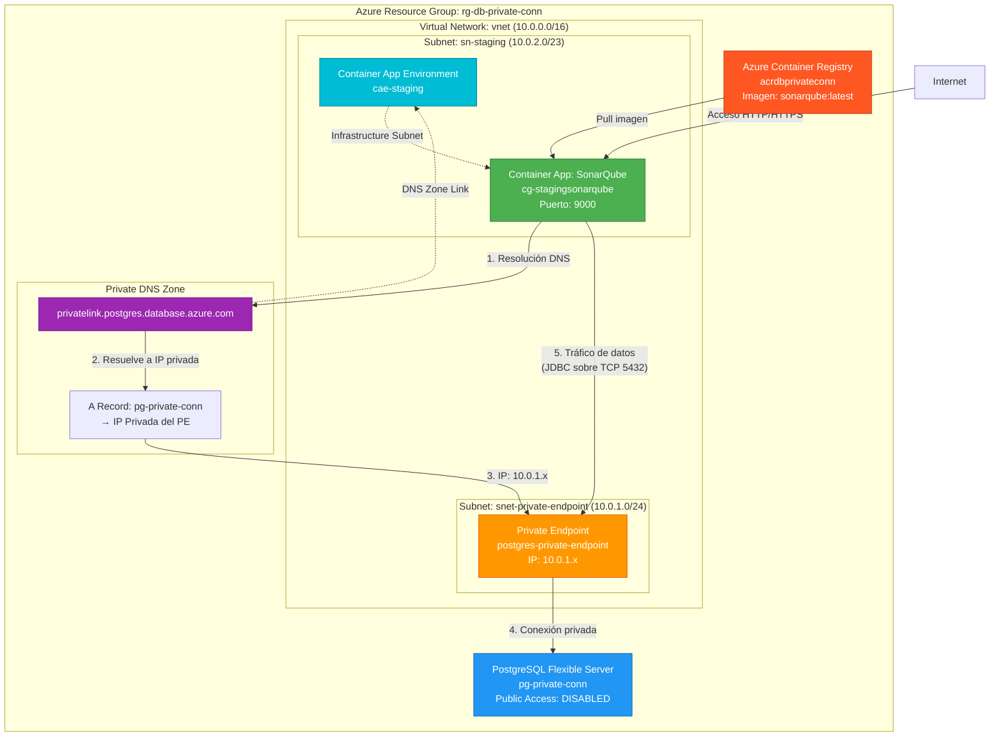

# Infraestructura Azure: Container App con Conexión Privada a PostgreSQL

Este proyecto de Terraform despliega una infraestructura en Azure que permite que una Container App (SonarQube) se comunique con una base de datos PostgreSQL Flexible Server a través de una red privada, sin exposición a Internet.

## 📋 Tabla de Contenidos

- [Arquitectura General](#arquitectura-general)
- [Recursos Desplegados](#recursos-desplegados)
- [Diagrama de Arquitectura](#diagrama-de-arquitectura)
- [Flujo de Comunicación](#flujo-de-comunicación)
- [Requisitos Previos](#requisitos-previos)
- [Despliegue](#despliegue)
- [Configuración de Variables](#configuración-de-variables)

---

## 🏗️ Arquitectura General

La infraestructura está diseñada para garantizar que la comunicación entre la Container App y PostgreSQL ocurra exclusivamente a través de la red privada de Azure (VNet), sin tráfico público. Esto se logra mediante:

1. **Virtual Network (VNet)**: Red privada aislada
2. **Subnets especializadas**: Separación de recursos por función
3. **Private Endpoint**: Punto de entrada privado al servicio PostgreSQL
4. **Private DNS Zone**: Resolución de nombres dentro de la VNet
5. **Container App Environment**: Entorno aislado para aplicaciones contenedorizadas

---

## 📦 Recursos Desplegados

### 1. Resource Group (`main.tf`)

```hcl
resource "azurerm_resource_group" "db_private_conn" {
  name     = "rg-db-private-conn"
  location = "East US"
}
```

**Explicación:**
- **Nombre**: `rg-db-private-conn` - Prefijo `rg-` indica Resource Group. El nombre es descriptivo y sigue convenciones de nomenclatura de Azure.
- **Location**: `East US` - Región donde se desplegarán todos los recursos. Debe ser consistente con otros recursos para minimizar latencia y costos de transferencia de datos.
- **Propósito**: Contenedor lógico que agrupa todos los recursos relacionados para facilitar su gestión, facturación y eliminación.

---

### 2. Virtual Network (`vnet.tf`)

```hcl
resource "azurerm_virtual_network" "vnet" {
  name                = "vnet"
  location            = azurerm_resource_group.db_private_conn.location
  resource_group_name = azurerm_resource_group.db_private_conn.name
  address_space       = ["10.0.0.0/16"]
}
```

**Explicación:**
- **Nombre**: `vnet` - Nombre simple ya que es el único VNet del proyecto. En proyectos más grandes, usar nombres como `vnet-prod-eastus`.
- **Address Space**: `10.0.0.0/16` - Rango de direcciones IP privadas (RFC 1918) que permite hasta 65,536 direcciones IP. El prefijo `/16` proporciona suficiente espacio para múltiples subnets.
- **Propósito**: Crea una red privada aislada donde todos los recursos pueden comunicarse de forma segura sin pasar por Internet público.

**¿Por qué `/16`?**
- Proporciona flexibilidad para agregar más subnets en el futuro
- Evita conflictos con redes corporativas comunes (muchas usan `10.0.0.0/8`)
- Permite segmentación clara con subnets `/24` o `/23`

---

### 3. Subnets (`subnet.tf`)

#### Subnet para Container App Environment

```hcl
resource "azurerm_subnet" "sn-staging" {
  name                 = "sn-staging"
  resource_group_name  = azurerm_resource_group.db_private_conn.name
  virtual_network_name = azurerm_virtual_network.vnet.name
  address_prefixes     = ["10.0.2.0/23"]
  service_endpoints    = ["Microsoft.Storage"]
}
```

**Explicación:**
- **Nombre**: `sn-staging` - Prefijo `sn-` indica Subnet. El nombre refleja el ambiente (staging).
- **Address Prefixes**: `10.0.2.0/23` - Rango que permite 512 direcciones IP (2^9). Suficiente para Container Apps y recursos relacionados.
- **Service Endpoints**: `["Microsoft.Storage"]` - Habilita acceso directo a Azure Storage desde esta subnet, mejorando seguridad y rendimiento.
- **Propósito**: Aísla el tráfico de Container Apps del resto de la infraestructura.

**¿Por qué `/23`?**
- Container App Environment requiere múltiples IPs para sus componentes internos
- Proporciona espacio para escalar sin necesidad de reconfigurar la red
- `/24` (256 IPs) podría ser insuficiente en algunos escenarios

#### Subnet para Private Endpoint

```hcl
resource "azurerm_subnet" "snet-private-endpoint" {
  name                 = "snet-private-endpoint"
  resource_group_name  = azurerm_resource_group.db_private_conn.name
  virtual_network_name = azurerm_virtual_network.vnet.name
  address_prefixes     = ["10.0.1.0/24"]
}
```

**Explicación:**
- **Nombre**: `snet-private-endpoint` - Nombre descriptivo que indica su propósito específico.
- **Address Prefixes**: `10.0.1.0/24` - Rango de 256 direcciones IP. Suficiente para múltiples Private Endpoints.
- **Propósito**: Subnet dedicada exclusivamente para Private Endpoints. Azure requiere que los Private Endpoints estén en una subnet separada por razones de seguridad y gestión.

**¿Por qué subnet separada?**
- Azure recomienda subnets dedicadas para Private Endpoints
- Facilita la aplicación de Network Security Groups (NSG) específicos
- Mejora la organización y el troubleshooting

---

### 4. PostgreSQL Flexible Server (`postgres.tf`)

```hcl
resource "azurerm_postgresql_flexible_server" "pg-private-conn" {
  name                   = "pg-private-conn"
  resource_group_name    = azurerm_resource_group.db_private_conn.name
  location               = "eastus2"
  administrator_login    = "pgadmin"
  administrator_password = "CibaoDev2025!"
  version                = "13"
  sku_name               = "B_Standard_B1ms"
  storage_mb             = 32768
  zone                   = "1"
  backup_retention_days  = 7
  public_network_access_enabled = false
  authentication {
    password_auth_enabled = true
  }
}
```

**Explicación detallada:**

- **Nombre**: `pg-private-conn` - Prefijo `pg-` indica PostgreSQL. Nombre descriptivo del propósito.
- **Location**: `eastus2` - Debe estar en la misma región o cercana a otros recursos para minimizar latencia.
- **Administrator Login**: `pgadmin` - Usuario administrador. En producción, usar nombres menos obvios.
- **Administrator Password**: ⚠️ **En producción, usar Azure Key Vault o variables de entorno de Terraform**.
- **Version**: `13` - Versión de PostgreSQL. Flexible Server soporta 11, 12, 13, 14, 15.
- **SKU Name**: `B_Standard_B1ms` - Burstable tier, Standard, 1 vCore, memoria pequeña. Ideal para desarrollo/testing.
  - `B` = Burstable (CPU compartida, económico)
  - `Standard` = Tipo de familia
  - `B1ms` = 1 vCore, memoria pequeña
- **Storage MB**: `32768` (32 GB) - Tamaño inicial del almacenamiento. Flexible Server permite auto-crecimiento.
- **Zone**: `1` - Availability Zone para alta disponibilidad. Opcional pero recomendado.
- **Backup Retention Days**: `7` - Retención de backups. Mínimo 7 días, máximo 35 días.
- **Public Network Access Enabled**: `false` - ⚠️ **CRÍTICO**: Deshabilita el acceso público. Solo se puede acceder a través de Private Endpoint.
- **Authentication**: Habilita autenticación por contraseña (además de Azure AD si se configura).

**¿Por qué `public_network_access_enabled = false`?**
- Garantiza que la base de datos solo sea accesible a través de la red privada
- Cumple con requisitos de seguridad y compliance
- Previene ataques desde Internet

---

### 5. Private Endpoint (`privateendpoint.tf`)

```hcl
resource "azurerm_private_endpoint" "postgres-private-endpoint" {
  name                = "postgres-private-endpoint"
  location            = azurerm_resource_group.db_private_conn.location
  resource_group_name = azurerm_resource_group.db_private_conn.name
  subnet_id           = azurerm_subnet.snet-private-endpoint.id

  private_service_connection {
    name                           = "postgres-privateserviceconnection"
    private_connection_resource_id = azurerm_postgresql_flexible_server.pg-private-conn.id
    subresource_names              = ["postgresqlServer"]
    is_manual_connection           = false
  }
}
```

**Explicación detallada:**

- **Nombre**: `postgres-private-endpoint` - Nombre descriptivo del recurso y su propósito.
- **Subnet ID**: Debe apuntar a la subnet dedicada para Private Endpoints (`snet-private-endpoint`).
- **Private Service Connection**:
  - **Name**: `postgres-privateserviceconnection` - Identificador único de la conexión.
  - **Private Connection Resource ID**: ID del servidor PostgreSQL al que se conecta.
  - **Subresource Names**: `["postgresqlServer"]` - Tipo de subrecurso. Para PostgreSQL Flexible Server siempre es `postgresqlServer`.
  - **Is Manual Connection**: `false` - Conexión automática. Azure gestiona la aprobación automáticamente.

**¿Qué hace el Private Endpoint?**
- Crea una IP privada (dentro de la VNet) que apunta al servicio PostgreSQL
- Permite que recursos en la VNet accedan a PostgreSQL usando esta IP privada
- El tráfico nunca sale de la red privada de Azure

**¿Por qué `subresource_names = ["postgresqlServer"]`?**
- Azure usa subrecursos para identificar el tipo de servicio dentro de un recurso
- Para PostgreSQL Flexible Server, el subrecurso es siempre `postgresqlServer`
- Esto permite que Azure enrute correctamente el tráfico

---

### 6. Private DNS Zone (`dnszone.tf`)

#### DNS Zone

```hcl
resource "azurerm_private_dns_zone" "dnszone-postgres" {
  name                = "privatelink.postgres.database.azure.com"
  resource_group_name = azurerm_resource_group.db_private_conn.name
}
```

**Explicación:**
- **Nombre**: `privatelink.postgres.database.azure.com` - ⚠️ **Este nombre es OBLIGATORIO y específico de Azure**. Azure usa este dominio para resolver nombres de servicios con Private Link.
- **Propósito**: Zona DNS privada que resuelve nombres de servicios a IPs privadas dentro de la VNet.

**¿Por qué este nombre específico?**
- Azure Private Link usa dominios específicos por tipo de servicio
- Para PostgreSQL: `privatelink.postgres.database.azure.com`
- Para otros servicios: `privatelink.blob.core.windows.net`, `privatelink.sql.azure.com`, etc.
- Si usas otro nombre, la resolución DNS no funcionará correctamente

#### DNS Zone Virtual Network Link

```hcl
resource "azurerm_private_dns_zone_virtual_network_link" "dnszone-link" {
  name                  = "vnet-dnszone-link"
  resource_group_name   = azurerm_resource_group.db_private_conn.name
  private_dns_zone_name = azurerm_private_dns_zone.dnszone-postgres.name
  virtual_network_id    = azurerm_virtual_network.vnet.id
}
```

**Explicación:**
- **Nombre**: `vnet-dnszone-link` - Nombre descriptivo del vínculo.
- **Propósito**: Conecta la Private DNS Zone con la VNet, permitiendo que recursos en la VNet resuelvan nombres usando esta zona DNS.

**¿Por qué es necesario?**
- Sin este vínculo, los recursos en la VNet no sabrían usar esta zona DNS
- Permite resolución automática de nombres dentro de la VNet
- Es un requisito para que Container Apps resuelvan el nombre del servidor PostgreSQL

#### DNS A Record

```hcl
resource "azurerm_private_dns_a_record" "postgres-a-record" {
  name                = "pg-private-conn"
  zone_name           = azurerm_private_dns_zone.dnszone-postgres.name
  resource_group_name = azurerm_resource_group.db_private_conn.name
  ttl                 = 300
  records             = [azurerm_private_endpoint.postgres-private-endpoint.custom_dns_configs[0].ip_addresses[0]]
}
```

**Explicación:**
- **Name**: `pg-private-conn` - Nombre del registro DNS. Debe coincidir con el nombre del servidor PostgreSQL.
- **TTL**: `300` segundos (5 minutos) - Tiempo de vida del registro DNS. Balance entre actualización y rendimiento.
- **Records**: IP privada asignada por el Private Endpoint. Se obtiene dinámicamente del Private Endpoint.

**¿Por qué el nombre debe coincidir con el servidor?**
- Cuando la aplicación usa `pg-private-conn.postgres.database.azure.com`, DNS resuelve a la IP privada
- El nombre completo será: `pg-private-conn.privatelink.postgres.database.azure.com`
- Pero Azure también permite usar el nombre corto si está configurado correctamente

**⚠️ Nota sobre `custom_dns_configs`:**
- El Private Endpoint crea automáticamente configuraciones DNS
- Accedemos a la primera IP privada asignada
- En producción, verificar que el Private Endpoint tenga al menos una IP asignada

---

### 7. Container App Environment (`env.tf`)

```hcl
resource "azurerm_container_app_environment" "cae-staging" {
  name                           = "cae-staging"
  location                       = azurerm_resource_group.db_private_conn.location
  resource_group_name            = azurerm_resource_group.db_private_conn.name
  internal_load_balancer_enabled = false
  infrastructure_subnet_id       = azurerm_subnet.sn-staging.id
  tags = {
    environment = "staging"
  }
}
```

**Explicación detallada:**

- **Nombre**: `cae-staging` - Prefijo `cae-` indica Container App Environment.
- **Internal Load Balancer Enabled**: `false` - Load balancer público. Si fuera `true`, solo sería accesible desde dentro de la VNet.
- **Infrastructure Subnet ID**: ⚠️ **CRÍTICO** - Debe apuntar a la subnet donde se desplegarán los Container Apps. Azure usa esta subnet para los componentes internos del ambiente.

**¿Por qué `infrastructure_subnet_id` es crítico?**
- Container App Environment necesita una subnet dedicada para sus recursos de infraestructura
- Esta subnet debe tener suficiente espacio de direcciones IP
- Los Container Apps desplegados en este ambiente usarán IPs de esta subnet para comunicación de red

**¿Por qué `internal_load_balancer_enabled = false`?**
- Permite acceso público a la aplicación (útil para SonarQube)
- Si fuera `true`, solo sería accesible desde dentro de la VNet
- Para aplicaciones internas, cambiar a `true` mejora la seguridad

---

### 8. Azure Container Registry (`acr.tf`)

```hcl
resource "azurerm_container_registry" "acr-db-private-conn" {
  name                = "acrdbprivateconn"
  resource_group_name = azurerm_resource_group.db_private_conn.name
  location            = azurerm_resource_group.db_private_conn.location
  sku                 = "Basic"
  admin_enabled       = true
}
```

**Explicación:**
- **Nombre**: `acrdbprivateconn` - ⚠️ **Debe ser único globalmente en Azure** y solo puede contener letras minúsculas y números. Máximo 50 caracteres.
- **SKU**: `Basic` - Tier básico, económico. Para producción considerar `Standard` o `Premium`.
- **Admin Enabled**: `true` - Habilita credenciales de administrador para autenticación. En producción, usar Managed Identity cuando sea posible.

**¿Por qué el nombre tiene restricciones?**
- ACR crea un FQDN público: `acrdbprivateconn.azurecr.io`
- Azure requiere nombres únicos globalmente
- Solo permite caracteres alfanuméricos para compatibilidad con DNS

---

### 9. Container App - SonarQube (`sonarqube.tf`)

```hcl
resource "azurerm_container_app" "cg-stagingsonarqube" {
  name                         = "cg-stagingsonarqube"
  resource_group_name          = azurerm_resource_group.db_private_conn.name
  container_app_environment_id = azurerm_container_app_environment.cae-staging.id
  revision_mode                = "Single"
  
  ingress {
    external_enabled = true
    target_port      = 9000
    traffic_weight {
      percentage      = 100
      latest_revision = true
    }
  }
  
  template {
    container {
      name  = "sonarqube"
      image = "${azurerm_container_registry.acr-db-private-conn.login_server}/sonarqube:latest"
      env {
        name  = "SONAR_JDBC_URL"
        value = "jdbc:postgresql://pg-private-conn.postgres.database.azure.com:5432/sonarqube?sslmode=require"
      }
      env {
        name  = "SONAR_JDBC_USERNAME"
        value = "pgadmin"
      }
      env {
        name  = "SONAR_JDBC_PASSWORD"
        value = "CibaoDev2025!"
      }
      cpu    = 2
      memory = "4Gi"
    }
  }
  
  registry {
    server               = azurerm_container_registry.acr-db-private-conn.login_server
    username             = azurerm_container_registry.acr-db-private-conn.admin_username
    password_secret_name = "acr-pull-secret"
  }
  
  secret {
    name  = "acr-pull-secret"
    value = azurerm_container_registry.acr-db-private-conn.admin_password
  }
}
```

**Explicación detallada:**

- **Nombre**: `cg-stagingsonarqube` - Prefijo `cg-` indica Container App (aunque algunos usan `ca-`).
- **Container App Environment ID**: Vincula la app al ambiente creado anteriormente.
- **Revision Mode**: `Single` - Solo una revisión activa. Para blue/green deployments usar `Multiple`.
- **Ingress**:
  - **External Enabled**: `true` - Accesible desde Internet.
  - **Target Port**: `9000` - Puerto por defecto de SonarQube.
- **Template - Container**:
  - **Image**: Imagen desde ACR. El `login_server` proporciona la URL completa.
  - **SONAR_JDBC_URL**: ⚠️ **CRÍTICO** - Usa el nombre del servidor PostgreSQL. DNS privado lo resuelve a la IP privada.
    - `pg-private-conn` - Nombre del servidor
    - `.postgres.database.azure.com` - Dominio estándar de Azure PostgreSQL
    - `:5432` - Puerto por defecto de PostgreSQL
    - `?sslmode=require` - Requiere conexión SSL/TLS
  - **CPU/Memory**: Recursos asignados al contenedor.
- **Registry**: Configuración para autenticarse con ACR y descargar la imagen.
- **Secret**: Almacena la contraseña de ACR de forma segura.

**¿Por qué el JDBC URL usa el nombre del servidor y no la IP?**
- El nombre se resuelve automáticamente a través de Private DNS Zone
- Más mantenible que usar IPs directas (que pueden cambiar)
- Permite usar el mismo código en diferentes ambientes

**⚠️ Seguridad:**
- Las contraseñas están en texto plano en el código
- En producción, usar Azure Key Vault o Managed Identity
- Considerar usar variables de Terraform con `sensitive = true`

---

## 🔄 Flujo de Comunicación

1. **Container App inicia** y necesita conectarse a PostgreSQL
2. **Resolución DNS**: La app intenta resolver `pg-private-conn.postgres.database.azure.com`
3. **Private DNS Zone**: La zona DNS privada intercepta la consulta
4. **DNS A Record**: Devuelve la IP privada del Private Endpoint (ej: `10.0.1.4`)
5. **Conexión de red**: El tráfico se enruta a través de la VNet
6. **Private Endpoint**: Recibe el tráfico en la subnet `snet-private-endpoint`
7. **PostgreSQL**: El Private Endpoint reenvía el tráfico al servidor PostgreSQL
8. **Respuesta**: El flujo se invierte para devolver datos a la Container App

**Todo el tráfico permanece dentro de la red privada de Azure, sin pasar por Internet.**

---

## 📊 Diagrama de Arquitectura



---

## 🔐 Consideraciones de Seguridad

### ⚠️ Mejoras Recomendadas para Producción

1. **Credenciales**:
   - Usar Azure Key Vault para almacenar contraseñas
   - Usar Managed Identity cuando sea posible
   - Rotar contraseñas regularmente

2. **Network Security Groups (NSG)**:
   - Agregar NSGs a las subnets para control de tráfico granular
   - Permitir solo tráfico necesario entre subnets

3. **Private Endpoint para ACR**:
   - Considerar Private Endpoint también para ACR
   - Evitar que las imágenes pasen por Internet

4. **Logging y Monitoreo**:
   - Habilitar Azure Monitor y Log Analytics
   - Configurar alertas para conexiones fallidas

5. **Backup y Disaster Recovery**:
   - Configurar backups automáticos de PostgreSQL
   - Planificar estrategia de recuperación

---

## 🚀 Requisitos Previos

- Azure CLI instalado y configurado
- Terraform >= 1.0
- Permisos suficientes en la suscripción de Azure
- Subscription ID configurado en `provider.tf`

---

## 📝 Despliegue

```bash
# Inicializar Terraform
terraform init

# Revisar el plan de despliegue
terraform plan

# Aplicar la configuración
terraform apply

# Destruir recursos (cuando sea necesario)
terraform destroy
```

---

## 🔧 Configuración de Variables

Para mejorar la configuración, considera crear un archivo `variables.tf`:

```hcl
variable "subscription_id" {
  description = "Azure Subscription ID"
  type        = string
}

variable "resource_group_name" {
  description = "Name of the resource group"
  type        = string
  default     = "rg-db-private-conn"
}

variable "location" {
  description = "Azure region"
  type        = string
  default     = "East US"
}

variable "postgres_admin_password" {
  description = "PostgreSQL administrator password"
  type        = string
  sensitive   = true
}
```

Y un archivo `terraform.tfvars` (no commitear a Git):

```hcl
subscription_id        = "147d994b-4b52-4afe-b06f-1465aba9d63e"
postgres_admin_password = "TuPasswordSeguro123!"
```

---

## 📚 Referencias

- [Azure Private Link Documentation](https://docs.microsoft.com/azure/private-link/)
- [Container Apps Documentation](https://docs.microsoft.com/azure/container-apps/)
- [PostgreSQL Flexible Server](https://docs.microsoft.com/azure/postgresql/flexible-server/)
- [Private DNS Zones](https://docs.microsoft.com/azure/dns/private-dns-overview)

---

## 📄 Licencia

Este proyecto es para fines educativos y de práctica.

